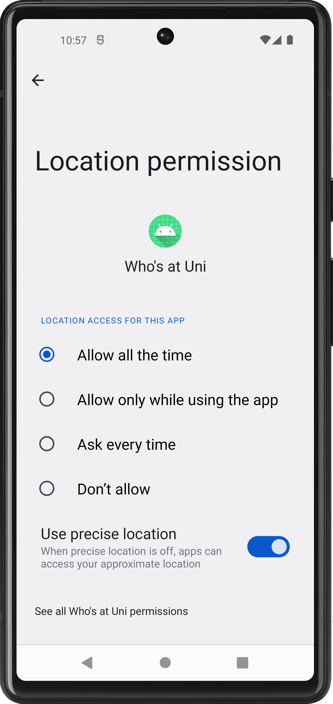

# PPM2023

Programmazione mobile project 2023

This app makes it a snap to check if your friends are studying at one of the supported UniGe locations via GPS service.

    

### Authentication and Registration

  

The application uses firebase autetication as the back-end service for user authentication.

### Integration with Firebase

Firebese Realtime Database is the service that tracks the status of all users.

### Permissions

  
   

The main permissions that the app requires are: background location access (which can only be requested through settings) and location access while using the app (which is necessary in order to request background location).

### Usage

Once we have logged in or registered and granted the necessary permissions we will be taken to the Main Activity, from here we can view our status (which is what the users we have chosen to add view) and the status of our friends. 

    

To update your status and receive any latest information from friends, you can drag your finger down (swipe-to-refresh).

If you wish, you can stop sharing your status by pressing the appropriate button in the top right corner, in which case the card in green will turn red and a "SharedPreference" will be updated so that this choice will remain saved even when you restart the app.

Clicking on the tab of a friend who is currently at the university will open Google Maps and automatically set the campus where our contact is currently located as the destination.

From the Main Activity it is possible to add a friend by pressing on the "+" button at the bottom right, a new activity will be loaded containing two fragments, in the first one we find a QR Code containing our UID, in the second fragment instead we find two buttons: the first one allows us to open the camera and scan the QR Code of a friend while the second one allows us to manually enter the friend's UID.

  
  

If you wish to share your UID in text format, simply tap on the code below your QR Code to copy it to the clipboard and send it via any messaging app.

From the Main Activity, it is also possible to open a side menu via the appropriate icon or by dragging your finger from the left side of the device to the right 

  

From this menu, in addition to logging out and reaching the project's github page, we can access a screen where we can remove users from our friends list. 

  

Once we remove a friend we will no longer receive updates regarding his status and likewise he will no longer receive ours.

#### Periodic service

The app updates the user's status every 20 minutes or so (if the user has not decided to stop sharing via the appropriate the button that updates the "SharedPreference"); the automatic update is done via a worker that is activated by both the main activity and the boot reciver (the latter, however, activates the worker 10 minutes after the phone is turned on to give the GPS time to start).

#### Disclaimer

This app was created as a university project for the Mobile Programming course, I do not recommend using it as it is no longer maintained
